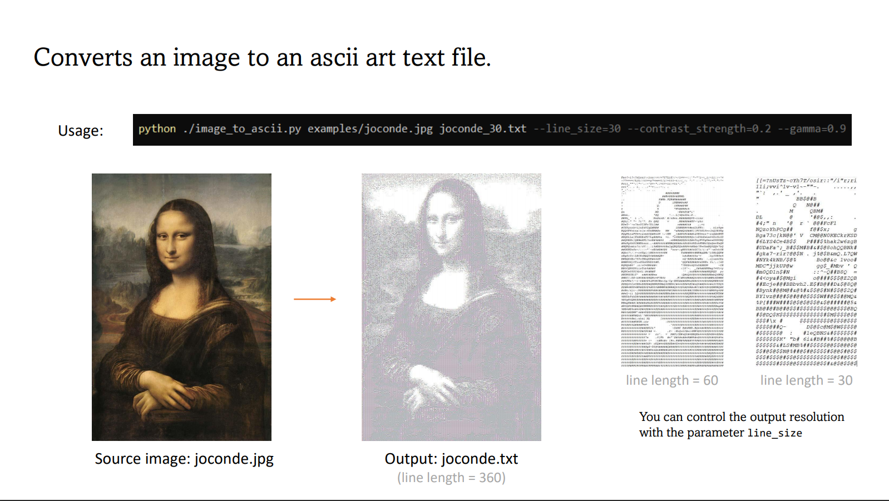
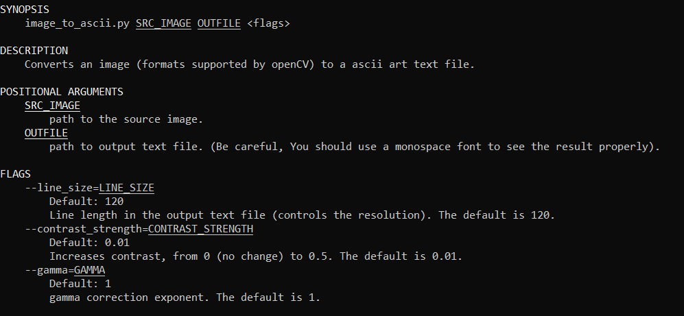

# image_to_ascii_art
A program that converts an image to ascii art text file

### Presentation

### Instructions

Install the required librairies with ``pip install -r requirements.txt`` if necessary.

